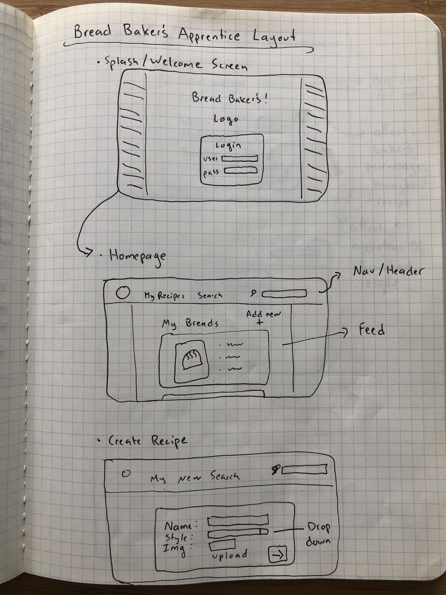

# Capstone Project Proposal

## 🍞 The Bread Baker's App(rentice) 🍞

### By: Elly Maimon

#### Project’s Purpose:

The purpose of Bread Baker's (App)rentice is to provide a connected organization platform that home or professional bakers can use as a resource to aid in their baking of breads. 

Bakers will have the ability to create and sift through personal and community-created recipes, scale the recipes, keep track of their starters, keep notes on variables during the baking process, and visualize all aspects of the process in detail. 

#### Minimum Features (MVP)

*The project will be built out with a React front-end, and implement either a C# or a Node.js back-end (in the form of an API) as a stretch goal.*

MVP Goals:
* User can log-in to an authenticated account
* User can create/edit/update/delete custom recipes using a pre-existing or custom ingredients
* User can view the recipe by baking convention units (% of flour, % hydration, etc.)
* User can scale the recipe to any weight or percent increase with ease
* User can use application to aid in baking process using timing features and reminders

#### Stretch Goals

*After the initial features are implemented, I will add a C#/.NET or a NodeJS backend and store user entries from the community, turning the application back-end into an API.* 

Stretch Goals:
* Users can browse recipes created by community members
* Users can vet recipes by rating or voting on them
* Users can comment on recipes

Stretchiest Goal:
* Create react native version of application to use on mobile

#### Layout Planning Sketches

